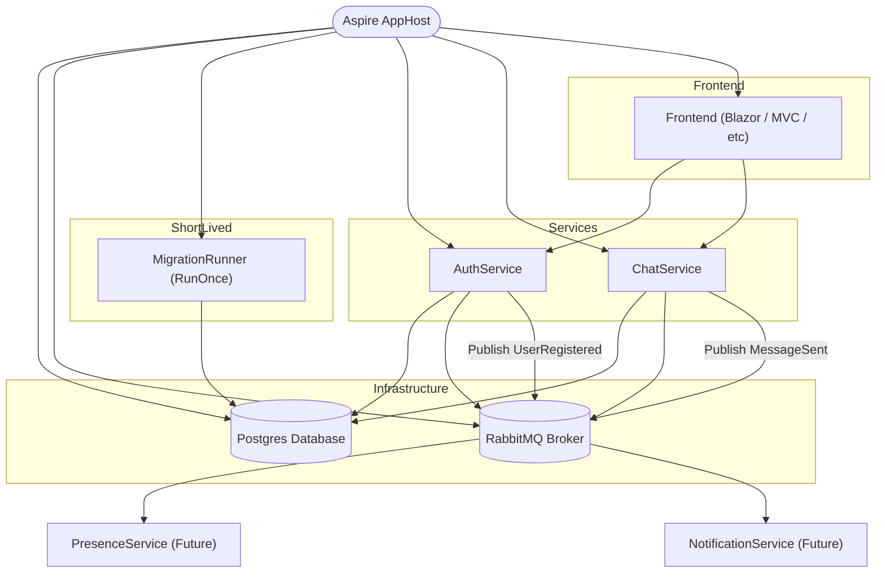

# lets-talk

A chat application using ASP.NET Core, Svelte and .NET Aspire.

```mermaid
flowchart TD
    AppHost([Aspire AppHost])

    subgraph Infrastructure
        Postgres[(Postgres Database)]
        RabbitMQ[(RabbitMQ Broker)]
    end

    subgraph ShortLived
        MigrationRunner["MigrationRunner (RunOnce)"]
    end

    subgraph Services
        AuthService["AuthService"]
        ChatService["ChatService"]
    end

    subgraph Frontend
        FrontendApp["Frontend (Blazor / MVC / etc)"]
    end

    AppHost --> Postgres
    AppHost --> RabbitMQ
    AppHost --> MigrationRunner
    MigrationRunner --> Postgres

    AppHost --> AuthService
    AppHost --> ChatService
    AppHost --> FrontendApp

    AuthService --> Postgres
    AuthService --> RabbitMQ

    ChatService --> Postgres
    ChatService --> RabbitMQ

    FrontendApp --> AuthService
    FrontendApp --> ChatService

    ChatService -- "Publish MessageSent" --> RabbitMQ
    AuthService -- "Publish UserRegistered" --> RabbitMQ

    %% Optionally, you could have new future services
    RabbitMQ --> PresenceService["PresenceService (Future)"]
    RabbitMQ --> NotificationService["NotificationService (Future)"]
```
